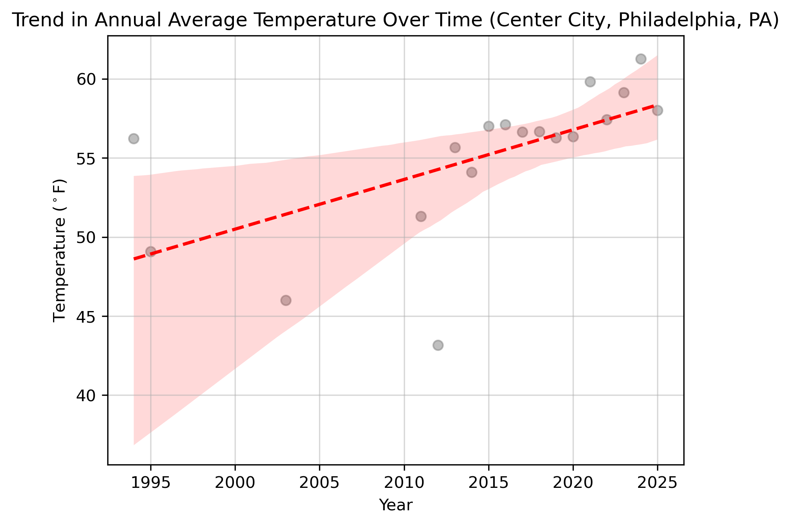

<html lang="en">
<head>
  <meta charset="UTF-8">
  <title>Charlie's Portfolio</title>
  
</head>
<body>

  <h1>Charlie Salvatore Wrede</h1>
  <h2>Hello! This is my Portfolio!</h2>

  

    
<b>Email:</b> chwr4840@colorado.edu

    
<b>GitHub:</b> <a href="https://github.com/charliewrede" target="_blank">charliewrede</a>

    
<b>LinkedIn:</b> 
      <a href="https://www.linkedin.com/in/charlie-wrede-8b65ab231" target="_blank">Charlie Wrede</a>
    

  

  

    <h2>Education</h2>
    
BA in Geography, certificate in GIS and Computational Science (expected May 2026).  

  

  

    <h2>Professional</h2>
    
GIS Intern at Tallgrass Energy (Summer 2025)

  

  

    <h2>Biography</h2>
    
Hello! My name is Charlie and I am passionate about GIS and Computer Science, specifically GIS development and data science.  
       I am hoping to continue to learn more about Computer Science as I progress as a student and I hope to get a minor or Masters in Computer Science.  
       I would like to work within either the tech or environmental field because I am motivated to solve challenging and fulfilling problems that will help me to become a better programmer.

  

  

    <h2> What is GIS?</h2>
    
Here’s a video showing what GIS is:  
      <a href="https://www.youtube.com/watch?v=WpoSofhf9Y0" target="_blank">Watch Video</a>
    

  

  <h2> Here's a Photo of Me! </h2>
  

  <h2> Projects </h2>

  <h3> Mapping Assignment in Python </h3>
  
Here’s a map I made in Python of my favorite vacation spot in Sicily (Brucoli):

  <embed type="text/html" src="Brucoli.html" width="500" height="500" style="max-width:90%;">

  <h3>Temperature Change over Time in Center City, Philadelphia</h3>
  
     
 This is a chart showing how temperature has changed in Center City, Philadelphia from 1993 to 2025. The data was specifically taken from from the Franklin Institute in Center City, Philadelphia. The data type used was Temperature at the time of observation. A OLS regression model was run on the data and shows significant warming in the area at a rate of 0.17 degrees Celsius a year. This data is quite variable though and so this warming could be slightly larger or smaller than what is shown here. 

   <a href="portfolio_posts/Climate_Code_Total.html" target="_blank">
    View Full Chart and Code
  </a>

<h3> Ruby Throated Hummingbirds Migration Project <h3>
  <embed type="text/html" src="portfolio_posts/migration.html" width= "100%" height= "800">
  
 Here is an interactive map showing Ruby Throated Hummingbirds migration by month over the course of the year 2023. The Ruby Throated Hummingbird is the only Hummingbird who inhabits the Eastern United States, it also inahibits southern Canada and as far west as Oklamhoma in the south and Alberta Canada in the North. For migration these birds migrate south across the Gulf of Mexico and winter in Southern Mexico and Central America. First lets learn some background about the beautiful Ruby Throated Hummingbird! Heres an image of a male:

  
  
 I think we can all see where the Ruby Throated Hummingbird gets it's name! Now lets learn some fun facts about this awesome beautiful bird. Firstly, the Ruby Throated Hummingbird can beat it's wings 50 times a second, allowing it to hover perfectly stationary. The hummingbirds nest is also intersting as it's built with plant matter thats woven together from spiderwebs and lichen, it's built just big enough for the mom to fit inside. A full grown adult hummingbird only wieghs 2-3 grams on average. Although they weight practically nothing, they still migrate all the way from as far as Canada to Mexico! Some do the trip all the way across the Gulf of Mexico in one 500 mile journey. In order to make this humongous journey they double there fat reserves and use favorable winds. Interestingly the map I found of there range seems to be a bit smaller than the range I found within my own map. My map showed many Hummingbirds farther north in Canada than what the map and range estimates say. Could this suggest the Ruby Throated Hummingbird is advancing it's range further north due to climate change? Or could it be that the regions I broke up the data into only make it seem that they are further north. In reality the hummingbird's only inhabit the southern tips of these regions. A common dilema when aggregating data into such large regions. From my research into the observation data this does seem to be the case, but it could make an interesting research question to see if hummingbirds range is advancing north due to higher temperatures. Heres some sources for the information: https://www.audubon.org/magazine/10-fun-facts-about-ruby-throated-hummingbird & https://www.allaboutbirds.org/guide/Ruby-throated_Hummingbird/overview 

  

</body>
</html>
